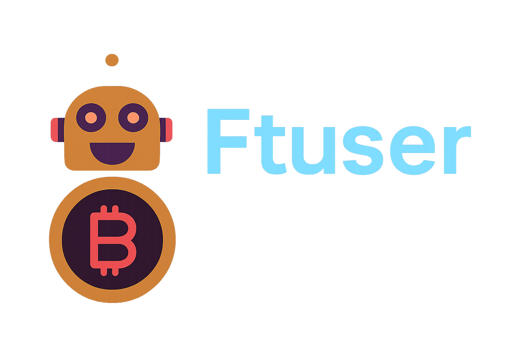

# 🚀 Complete Freqtrade Multi-Strategy Guide

## Professional Multi-Strategy Trading Bot System

This comprehensive guide will walk you through setting up, backtesting, and running **multiple independent trading strategies** with a **unified monitoring interface**. Designed for traders who want to deploy professional algorithmic trading with [Freqtrade](https://www.freqtrade.io/en/latest/).

---

## 🎯 **What You'll Build**

### **Multi-Strategy Architecture**
- **Multiple Independent Trading Bots** running simultaneously
- **1 Unified Interface** to monitor all strategies at once
- **Separate Docker Containers** for each strategy (isolation & reliability)
- **Organized Backtesting** with strategy-specific results
- **Professional-grade Setup** suitable for real trading

---

## 📚 **Complete Guide Structure**

### **🏗️ PHASE 1: Initial Setup**
Start here if you're completely new to Freqtrade:

📖 **[1. Setup Guide](docs/setup-guide.md)**
- **Python Environment**: Install Python, TA-Lib, and Freqtrade dependencies
- **Docker Deployment**: Enterprise-grade multi-container deployment
- **Professional installation instructions** with troubleshooting

### **🧪 PHASE 2: Strategy Testing**
Validate strategies through comprehensive backtesting before live deployment:

📖 **[2. Backtesting Guide](docs/BACKTESTING_GUIDE.md)**
- Understand StaticPairList vs VolumePairList
- Run organized backtests for each strategy
- Analyze historical performance
- Export trading signals for analysis

📖 **[3. Backtest Analysis](docs/BACKTEST_ANALYSIS.md)**
- Interpret backtest results
- Identify profitable strategies
- Understand performance metrics
- Optimize strategy parameters

### **🎮 PHASE 3: Live Trading Setup**
Deploy your strategies in dry-run mode:

📖 **[4. Unified UI Guide](docs/UNIFIED_UI_GUIDE.md)**
- Configure multi-strategy monitoring
- Set up CORS for unified interface
- Access all strategies from one dashboard
- Manage multiple Docker containers

📖 **[5. Dry Run Operations Guide](docs/DRY_RUN_GUIDE.md)**
- Start and stop dry run trading safely
- Operate multiple strategies simultaneously
- Verify simulation mode is active
- Test strategies with virtual money

📖 **[6. Monitoring Guide](docs/MONITORING_GUIDE.md)**
- Monitor live trading activity
- Check logs and performance
- Troubleshoot common issues
- Control running strategies

### **🔧 PHASE 4: System Operations**
Extend and manage your multi-strategy system:

📖 **[7. Strategy Addition Guide](docs/STRATEGY_ADDITION_GUIDE.md)**
- Add new strategies to existing system
- Maintain proper directory structure
- Configure docker-compose for new strategies
- Integrate with unified monitoring interface

---

## 🧠 **Understanding Multi-Strategy Architecture**

### **Why Multiple Strategies?**
- **Diversification** - Different strategies perform well in different market conditions
- **Risk Management** - One strategy's losses can be offset by another's gains
- **Market Coverage** - Cover more trading opportunities across timeframes
- **Performance Optimization** - Find the best-performing combination

### **Independent Container Architecture**
```
Multi-Strategy Container Deployment
┌────────────────────────────────────────────────────────────────────────────-┐
│                               HOST SYSTEM                                   │
├────────────────────────────────────────────────────────────────────────────-┤
│  Strategy Container A  │  Strategy Container B  │  Strategy Container C     │
│  ┌────────────────────┐│  ┌────────────────────┐│  ┌──────────────────────┐ │
│  │   Strategy Alpha   ││  │   Strategy Beta    ││  │   Strategy Gamma     │ │
│  │                    ││  │                    ││  │                      │ │
│  │   Port: 8080       ││  │   Port: 8081       ││  │   Port: 8082         │ │
│  │   UI: ✅ Main      ││  │   UI: ❌ API Only  │ │  │   UI: ❌ API Only    │ │
│  │   Isolated Data    ││  │   Isolated Data    ││  │   Isolated Data      │ │
│  │   Independent      ││  │   Independent      ││  │   Independent        │ │
│  └────────────────────┘│  └────────────────────┘│  └──────────────────────┘ │
└────────────────────────────────────────────────────────────────────────────-┘
         │                         │                        │
         └─────────────────────────┼────────────────────────┘
                                   │
                     ┌─────────────▼─────────────┐
                     │    Unified FreqUI         │
                     │  http://127.0.0.1:8080    │
                     │  • Monitor all strategies │
                     │  • Switch between bots    │
                     │  • Centralized control    │
                     │  • Combined analytics     │
                     └───────────────────────────┘
```

**Key Architecture Benefits:**
- **Isolation**: Each strategy runs independently with its own database and logs
- **Scalability**: Add or remove strategies without affecting others
- **Reliability**: If one strategy fails, others continue running
- **Flexibility**: Each container can have different configurations and resources
- **Unified Management**: Single interface to monitor and control all strategies

### **Key Technical Concepts**

#### **StaticPairList vs VolumePairList**
- **StaticPairList** - Fixed list of trading pairs (used for backtesting)
- **VolumePairList** - Dynamic pairs based on trading volume (used for live trading)

#### **Docker Compose Multi-Container**
- Each strategy runs in its own isolated container
- Separate logs, databases, and configuration files
- Independent restart/stop capabilities
- Shared volume for data access

#### **CORS Configuration**
- Cross-Origin Resource Sharing allows unified UI access
- All strategy APIs accessible from main interface
- Secure authentication across all containers

---

## ⚡ **Quick Start (15 Minutes)**

### **Prerequisites**
- macOS computer (ARM64)
- Docker installed
- Basic terminal knowledge

### **Rapid Deployment**
```bash
# 1. Navigate to project directory
cd ftuser

# 2. Start all strategies
docker compose -f docker-compose-multi.yml up -d

# 3. Open unified interface
open http://127.0.0.1:8080

# 4. Login with default credentials
# Username: freqtrader
# Password: SuperSecretPassword
```

### **First Steps Checklist**
- [ ] ✅ All containers running (`docker compose ps`)
- [ ] ✅ Can access UI at http://127.0.0.1:8080
- [ ] ✅ Can login with provided credentials
- [ ] ✅ Can see strategy dropdown in UI
- [ ] ✅ Logs showing "Bot heartbeat" messages

---

## 🎯 **Implementation Paths**

### **Development & Testing Path**
1. Read **[Setup Guide](docs/setup-guide.md)** - Install environment
2. Follow **[Backtesting Guide](docs/BACKTESTING_GUIDE.md)** - Validate strategies
3. Review **[Backtest Analysis](docs/BACKTEST_ANALYSIS.md)** - Optimize performance
4. Deploy using **[Unified UI Guide](docs/UNIFIED_UI_GUIDE.md)** - Go live (dry-run)
5. Monitor with **[Monitoring Guide](docs/MONITORING_GUIDE.md)** - Track execution

### **Production Deployment Path**
1. Review **[Backtesting Guide](docs/BACKTESTING_GUIDE.md)** - Validate strategy performance
2. Use **[Unified UI Guide](docs/UNIFIED_UI_GUIDE.md)** - Deploy multi-strategy architecture
3. Follow **[Dry Run Operations Guide](docs/DRY_RUN_GUIDE.md)** - Start and stop dry run trading safely
4. Implement **[Monitoring Guide](docs/MONITORING_GUIDE.md)** - Production monitoring

### **Quick Deployment**
1. Use **docker-compose-multi.yml** directly
2. Customize strategies in `user_data/strategies/`
3. Refer to individual guides as needed

---

## 🛡️ **Safety & Risk Management**

### **Always Start with Dry-Run**
- All guides assume **dry-run mode** (no real money)
- Test strategies thoroughly before considering live trading
- Understand each strategy's risk profile

### **Risk Guidelines**
- **Never risk more than you can afford to lose**
- **Start with small amounts** when going live
- **Monitor constantly** during first weeks
- **Diversify across strategies** to reduce risk

### **Dry-Run Trading Benefits**
- Validate strategies without financial risk
- Test strategy modifications safely
- Analyze market behavior patterns
- Verify system performance and reliability

---

## 🔧 **Troubleshooting Quick Links**

### **Common Issues**
- **Container won't start** → Check Docker installation
- **Can't access UI** → Verify port 8080 is free
- **No trading signals** → Check market data and strategy conditions
- **Login issues** → Use default credentials: freqtrader/SuperSecretPassword

### **Getting Help**
- Check individual guide troubleshooting sections
- Review Docker container logs: `docker logs freqtrade-first`
- Verify API endpoints: `curl http://127.0.0.1:8080/api/v1/ping`

---

## 📚 **Additional Resources**

### **Official Documentation**
- [Freqtrade Documentation](https://www.freqtrade.io/en/stable/)
- [Docker Documentation](https://docs.docker.com/)
- [TA-Lib Indicators](https://ta-lib.org/function.html)

### **Community**
- [Freqtrade Discord](https://discord.gg/MA9v74M)
- [GitHub Repository](https://github.com/freqtrade/freqtrade)
- [Trading Strategy Discussion](https://github.com/freqtrade/freqtrade-strategies)

---

## ⚠️ **Disclaimer**

This setup is for **educational and research purposes**. Cryptocurrency trading involves significant risk. Past performance does not guarantee future results. Always:

- Start with dry-run mode for validation
- Never invest more than you can afford to lose
- Understand tax implications in your jurisdiction
- Consider consulting with financial advisors

---

**Ready to start? Begin with the [Setup Guide](docs/setup-guide.md)! 🚀** 